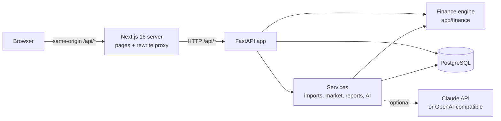
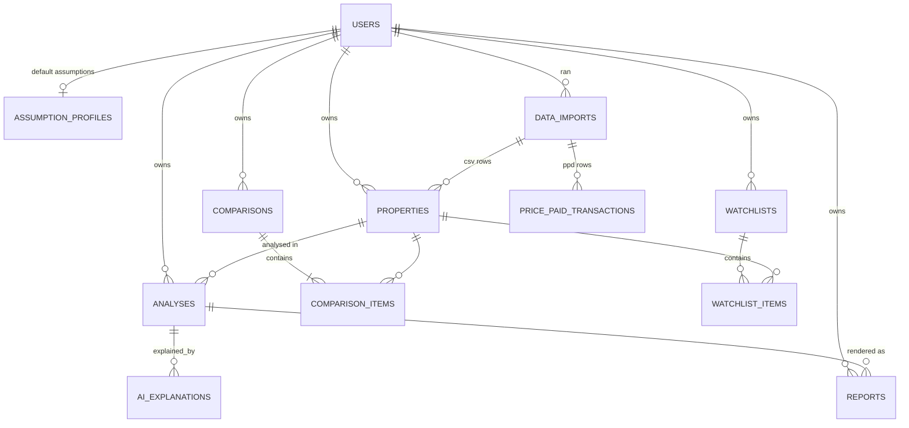

# Architecture

Prophecy is a two-tier web application: a Next.js frontend and a FastAPI backend backed by
PostgreSQL. All financial logic lives in a pure-Python engine that has no database or web
dependencies, so it can be tested exhaustively and reused (API, reports, explanations).

## Request path

* The browser only ever calls `/api/*` on the frontend's own origin. `next.config.ts` rewrites
  those requests to the backend (`API_ORIGIN`). The session cookie is therefore first-party,
  `httpOnly`, `SameSite=Lax`, and no CORS is needed in the browser.
* `src/proxy.ts` (Next.js 16's renamed middleware) performs an optimistic redirect to `/login`
  when no session cookie is present. It is a UX convenience; **the API is the security
  boundary** and validates the token on every request.
* App pages are client components using TanStack Query. The app shell sits inside
  `<Suspense>` because it reads the URL, as Cache Components requires.

## Backend layout

| Path | Responsibility |
| --- | --- |
| `app/finance/` | Pure calculation engine: SDLT/LBTT/LTT, mortgages, tax scenarios, IRR, projections, break-even, sensitivity, scenarios |
| `app/api/routes/` | HTTP endpoints, request validation, ownership checks |
| `app/services/` | Imports (Land Registry, CSV), market analytics, reports, AI explanations, deal assembly |
| `app/models/` | SQLAlchemy 2 ORM models |
| `app/schemas/` | Pydantic request/response models |
| `alembic/` | Database migrations |
| `app/cli.py` | Operational commands (bulk import, grant admin, extract samples) |

## Data model

Key decisions:

* **Analyses are snapshots.** `analyses.inputs` and `analyses.results` store the full engine
  input and output as JSON with `engine_version`, so a saved analysis or report never changes
  when defaults or rules change later.
* **Provenance is stored, not inferred.** `properties.data_source` (`manual`, `csv_import`,
  `demo`), `properties.rent_source` (`user_estimate`, `agent_quote`, `current_tenancy`, `demo`),
  `properties.is_demo` and `data_imports` (file hash, licence, attribution, row counts, rejected
  rows, date range) travel with the data into the UI and reports.
* **Market data is shared; everything else is private.** `price_paid_transactions` is reference
  data visible to all users, so only administrators can import it. Every user-owned table has
  an `owner_id`, and every query filters on it.
* **Assumption precedence:** request overrides > property overrides > user profile > engine
  defaults (`services/deals.py::build_inputs`).

## Financial engine (`app/finance`)

* `inputs.DealInputs` is a strict Pydantic model (`extra="forbid"`, bounded ranges); invalid
  deals are rejected before any maths runs.
* `engine.analyse_deal` returns a `DealAnalysis`. Every headline figure is a `Metric` with
  `formula`, the concrete `inputs` used, a `basis` (`calculated` or `estimate`) and an
  optional note. The UI's "show the working" feature renders these directly.
* Mortgage schedules are computed monthly and aggregated by year, so interest falls as a
  repayment loan amortises and payments stop at the end of the term.
* Transaction tax rules (`sdlt.py`) are versioned with a `RULES_REVIEWED_ON` date and official
  source links. Bands are applied marginally; surcharges (higher rates for additional
  dwellings, non-resident, Scottish ADS, Welsh higher rates) are explicit.
* Tax scenarios (`tax.py`) model Section 24 for individuals and corporation tax with marginal
  relief for companies. Their standing caveats are returned as `tax_notes`, separate from
  deal-specific `warnings`.
* `insights.py` derives break-even points (bisection on the engine itself), a one-at-a-time
  sensitivity table and base, optimistic and pessimistic scenarios with per-driver attribution.
* IRR uses bisection rather than Newton's method so it converges for unusual cash-flow shapes,
  and returns `None` instead of a misleading number when no sign change exists.

## Market data

* `services/imports/ppd.py` streams the official Land Registry CSV in 50k-row chunks with
  pandas, validates every column (GUID format, price range, date, enumerations), rejects bad
  rows with reasons, and upserts on `transaction_id`. Record status `C` updates and `D`
  deletes, following the PPD specification. A full year (929,467 rows) imports in about 75
  seconds on a laptop.
* `services/market.py` computes statistics with pandas on the filtered rows, always returning
  sample sizes and flagging small samples. Only standard (category A) transactions are used.
* **Model evaluation is computed, not claimed.** `evaluate_comparables_model` performs a
  time-split backtest: medians from earlier sales (postcode sector and type, falling back to
  district) predict the most recent three months. It reports median and mean absolute
  percentage error, hit rates and coverage against a naive district-median baseline. On the
  2024 national file this gives a 16.8% median error, against 26.8% for the baseline, on
  220,344 held-out sales; the figure changes with whatever data is imported.

## AI explanations

* `services/ai/base.py` defines a provider protocol and the structured `ExplanationContent`
  schema (summary, strengths, weaknesses, risks with severity, yield and cash-flow commentary,
  sensitivity, improvements, caveats).
* Providers: `AnthropicProvider` (official SDK, `messages.parse` structured output, default
  model `claude-opus-5`), `OpenAICompatibleProvider` (any Chat Completions endpoint with JSON
  schema output) and `RuleBasedProvider` (deterministic thresholds, always available).
* **Grounding:** the model only receives the calculated metrics, inputs, break-even and
  sensitivity results, and (if present) Land Registry comparable statistics with their source.
  The system prompt forbids outside facts. After generation, `find_unverified_figures` checks
  every £ and % figure in the text against the supplied numbers (unit-aware, allowing sums,
  differences and monthly/annual restatements) and the UI flags any that cannot be traced.
* **Failure isolation:** with no key configured, or on any provider error or refusal, the
  service falls back to the rule-based explanation and says so. Nothing else in the platform
  depends on AI.

## Security

* Passwords hashed with Argon2id (`argon2-cffi`); a dummy verification equalises login timing
  for unknown emails.
* JWT (HS256) sessions in an `httpOnly`, `SameSite=Lax` cookie (`Secure` enforced in
  production). Tokens carry a `token_version`; changing the password or choosing
  "sign out everywhere" increments it and revokes every existing token.
* CSRF defence in depth: SameSite cookies plus an Origin check that rejects cross-site unsafe
  requests.
* Login rate limiting (sliding window per IP and email). It is in-memory, which is correct for
  one API instance; multiple instances should move it to Redis or the edge.
* Ownership checks return 404 rather than 403, so IDs belonging to other users are not
  revealed.
* Uploads: extension and content-type checks, streaming size limit, SHA-256 recorded,
  duplicate Land Registry files refused.
* Production refuses to start with the development secret or without `COOKIE_SECURE=true`.
* Security headers on both tiers (`nosniff`, `DENY` framing, referrer policy); API responses
  are `Cache-Control: no-store`.

## Trade-offs and known limitations

* **Floats rather than Decimal** in the engine: results are rounded to pennies for display and
  transaction tax is rounded down to the pound as the authorities do. This is adequate for
  estimates, not for accounting.
* **Simplified tax.** No personal allowance interaction, Scottish income tax bands, loss
  carry-forward, dividend extraction or multiple-dwellings rules. These limits are stated in
  the UI and in every report.
* **No rental data source.** There is no free, licensable UK rental comparables API, so rents
  are always user-supplied and labelled by source.
* **No live listings.** Property portals do not offer public APIs, and scraping would breach
  their terms.
* **Reports are stored in PostgreSQL** (`reports.content`) for simplicity; object storage would
  suit high volumes better.
* **In-memory caches and rate limits** assume a single API process.
